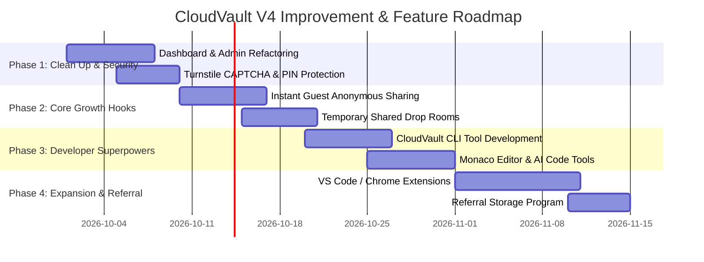

# 🚀 CloudVault V4 - Suggested Changes & Growth Roadmap
> **Comprehensive Guide**: Existing Improvements, Security Upgrades, and New Features to Attract Mass Users.

---

## 📌 Executive Summary (Project Overview)
**CloudVault V4** ek modern, privacy-focused cloud storage, clipboard aur code sharing platform hai. Yeh students aur developers ke liye lab PCs, shared computers aur multi-device environments me **bina account login kiye ya USB drive lagaye fast & encrypted file/code transfer** karne ke liye perfect tool hai.

Is document me:
1. **Existing Codebase Changes & Technical Improvements** (UI/UX, Performance, Code Refactoring, Security).
2. **New Killer Features for Viral User Growth** (Student, Developer & Privacy Enthusiast Acquisition).
3. **Marketing & User Acquisition Strategy**.
4. **Implementation Roadmap**.

---

## ⚡ Part 1: Recommended Changes & Technical Refinements (Kya-Kya Badlaav Zaroori Hai)

### 1. 🏗️ Codebase & Architecture Refactoring
- **Split Monolithic Page Files**:
  - `Dashboard.jsx` (~231 KB) aur `Admin.jsx` (~120 KB) bahut bade single-file components hai.
  - **Change Needed**: Inhe chhote, reusable sub-components me split karein:
    - `components/dashboard/FileGrid.jsx`
    - `components/dashboard/SnippetEditor.jsx`
    - `components/dashboard/ShareModal.jsx`
    - `components/dashboard/StorageAnalytics.jsx`
  - **Benefit**: Faster rendering, easier maintenance, reduced re-renders.

- **Global Drag-and-Drop Zone**:
  - Home aur Dashboard par kahin bhi file drag-and-drop karke direct upload trigger ho.
  - Full-screen visual drop overlay with smooth blur & ripple effect.

---

### 2. 🛡️ Security & Abuse Prevention Upgrades
- **Brute-Force Protection on 6-Digit Codes**:
  - 6-digit numeric/alphanumeric code guess karne wale bots ko roknay ke liye **Cloudflare Turnstile / CAPTCHA** lagayein (after 3 failed code attempts).
  - Exponential rate-limiting (e.g. 1-minute ban after 5 incorrect codes from an IP).

- **Password/PIN Protected Share Links**:
  - 6-digit code ke alawa, user **optional 4-digit PIN ya password** set kar sake.
  - Shared link access karne par pehle PIN mangega, fir download/view render hoga.

- **Burn-After-Read (Self-Destruct Timer)**:
  - Option to auto-delete file/snippet **X seconds after recipient views/downloads it**.
  - Direct database trigger for privacy-conscious users.

- **Zero-Knowledge Client-Side Vault Encryption**:
  - Default AES-256 for private notes/files with client-derived key from user master passphrase. (Database admin bhi raw content padh nahi sakega).

---

### 3. 🚀 UI / UX & Performance Enhancements
- **Global Search & Command Palette (`Ctrl + K` / `Cmd + K`)**:
  - Instant spotlight search across all files, code snippets, trash, and settings.

- **Chunked & Resumable Big File Uploads**:
  - TUS protocol ya multipart Supabase/S3 storage upload support taaki bade files (500MB+) bina disconnect hue upload ho sakien.

- **Interactive Code Editor with Syntax Highlighting & Diff Viewer**:
  - Code snippets preview me **Monaco Editor (VS Code core)** / **CodeMirror** integrate karein, taaki live line numbers, folding, aur multi-language formatting mile.

- **PWA & Offline Clipboard**:
  - Progressive Web App offline caching refine karein taaki draft notes Internet disconnected hone par bhi locally save rahein.

---

## 🚀 Part 2: New Features to Attract Mass Users (User Growth Hooks)

Agar CloudVault me ye killer features add kiye jaayein, toh **Students, Developers, Freelancers aur Tech Teams** isse rooz use karenge:

---

### 1. ⚡ Instant Guest Transfer (Zero Sign-up Anonymous Sharing)
- **Concept**: User site open kare -> Direct File Drop kare -> **Instant 6-digit code & Shareable URL** mil jaye. *Zero registration required!*
- **Why Users Will Come**:
  - WeTransfer / Wormhole ki tarah bina login kiye 1-second transfer.
  - College lab me jahan student account login nahi karna chahta, wahan ye 100% go-to tool ban jayega.
  - Page par **"Save to Vault permanently? Sign up in 1 click"** banner se rapid conversion milega.

---

### 2. 👥 Temporary Shared "Drop Room" / Lab Room
- **Concept**: User ek 4-character Room Code bana sake (e.g. `ROOM-404`).
- **Use Case**:
  - A classroom/lab lecture standard practice: Professor ya lab partner `ROOM-404` batayega.
  - Pure batch ke students room code enter karke ek hi Jagah files, code, assignments drop & download kar sakenge.
  - Room 2 hour baad auto-expire ho jayega.
- **Why Users Will Come**: Groups & College batches me ek sath virally spread hoga!

---

### 3. 💻 CloudVault CLI (Terminal Command Line Tool for Developers)
- **Concept**: Lightweight npm/bash package: `npm install -g cloudvault-cli`
- **Commands**:
  ```bash
  # Quick file share from terminal
  cv share script.js --ttl 1h
  # Output: 🔑 Access Code: 894-201 | Link: https://cloudvault.app/v/894201

  # Quick fetch to local machine
  cv get 894201
  ```
- **Why Users Will Come**: Linux / Terminal power users aur DevOps developers ke liye absolute dream tool.

---

### 4. 🧩 VS Code & Chrome Extensions
- **VS Code Extension**:
  - Code selection par right click -> **"Share via CloudVault"** -> 6-digit code auto-copied to clipboard.
- **Chrome / Edge Extension**:
  - Any web page par text highlight karke instant CloudVault quick pastebin me save ya share.

---

### 5. 🤖 AI-Powered Developer Superpowers
- **AI Code Explainer & Bug Finder**:
  - Shared code snippet dekhte waqt **"Explain Code"** ya **"Find Security Vulnerabilities"** button.
- **AI Code / Format Converter**:
  - 1-Click conversion: `JSON ↔ YAML`, `SQL ↔ TypeScript Types`, `C++ ↔ Python`.
- **OCR Image-to-Text / Code Extractor**:
  - Lab whiteboard ya assignment paper ki photo drop karne par text & code extract karke snippet me convert kar de.

---

### 6. 🔄 Real-Time Live Collaborative Pastebin
- **Concept**: Multiple users ek hi code snippet link par realtime type & chat kar saken (like Google Docs for code, powered by Supabase Realtime / WebSockets).
- **Use Case**: Coding interviews, lab assignment debugging, remote code help.

---

### 7. 🎁 Referral Program & Gamified Storage Quota
- **Concept**: User apne link se doston ko invite kare -> **Both get +500 MB extra permanent vault storage**.
- **Viral Coefficient**: Users fast storage upgrade ke liye WhatsApp groups & Reddit par links share karenge.

---

## 📊 Summary Comparison: Before vs. After New Features

| Feature Area | Current CloudVault V4 | Enhanced CloudVault V4 (Proposed) | Impact on Users |
| :--- | :--- | :--- | :--- |
| **Onboarding** | Registration / Login mandatory for vault | **Instant Guest Anonymous Share (0-click)** | ⚡ 10x Top-of-Funnel User Traffic |
| **Developer Tools** | Web UI dashboard | **Terminal CLI + VS Code Extension** | 💻 Dev Community Adoption |
| **Group Transfer** | 1-to-1 share code | **Temporary Collaborative Drop Rooms** | 🎓 Viral Spread in Colleges & Labs |
| **Code Viewing** | Static Code viewer | **Monaco Editor + AI Explainer + Live Pair Edit** | 🧠 High Daily Retention |
| **Security** | Rate limit + RLS | **Turnstile CAPTCHA + PIN Protection + Self Destruct** | 🛡️ Trust & Security Grade A+ |

---

## 🎯 Marketing & User Acquisition Plan (Kaise Users Layen)

1. **Engineering Colleges & University Labs**:
   - Target student communities on Telegram, WhatsApp, Discord, LinkedIn.
   - Positioning: *"No USB drive allowed in Lab? Transfer code & files in 5 seconds with CloudVault!"*

2. **Developer Channels**:
   - Launch **CloudVault CLI & Open-Source Tools** on **Product Hunt**, **Hacker News (Show HN)**, and **Reddit (r/webdev, r/programming, r/selfhosted)**.

3. **SEO & High-Intent Landing Pages**:
   - Create targeted pages:
     - `/instant-code-share`
     - `/anonymous-file-transfer`
     - `/online-temporary-clipboard`
     - `/json-to-yaml-converter`

4. **Freemium & Team Monetization**:
   - **Free Plan**: 2 GB Storage, Unlimited 6-Digit Transfers, 100MB File Size Limit.
   - **Pro Plan ($4.99/mo)**: 100 GB Storage, Custom Share Subdomains (`yourname.cloudvault.app`), End-to-End Encryption Key Backups, Priority Speed.

---

## 🗓️ Implementation Roadmap (Phased Execution Plan)



---

## 💡 Conclusion
CloudVault V4 ka base foundation (Fast 6-digit codes, Supabase backend, AES Encryption, PWA) already bohot strong hai. Isme **Instant Guest Sharing, CLI Tool, Temporary Drop Rooms, aur Monaco/AI Code utilities** integrate karke isse **WeTransfer + Pastebin + Dev Tools** ka sabse powerful hybrid banaya ja sakta hai, jisse daily thousands of active users engage honge!
